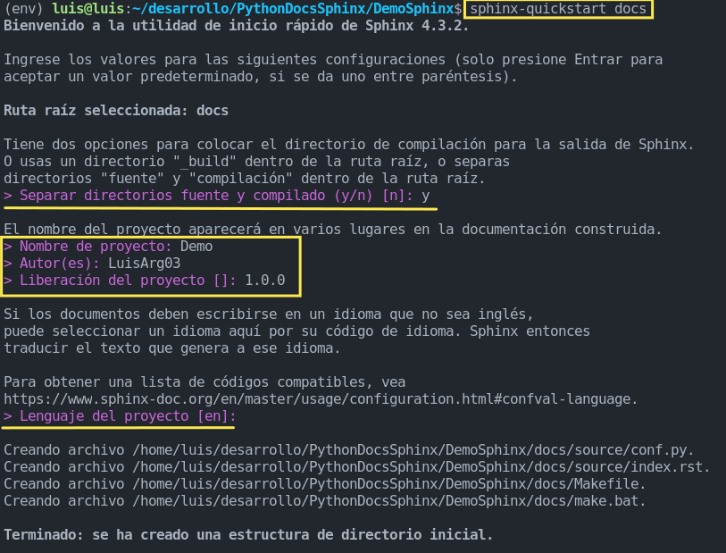
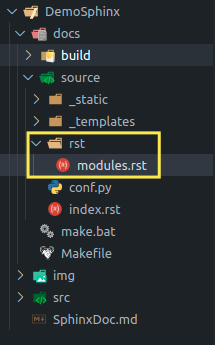

# Sphinx para autogeneración de documentación

## Tabla de contenidos
1. [Que es Sphinx](#que-es-sphinx)
	- [Generador de documentación](#generador-de-documentación)
	- [ReStructuredText](#restructuredtext)
3. [Instalación](#instalación)
4. [Inicio rápido](#inicio-rápido)
5. [Referencias](#referencias)


## Que es Sphinx

### Generador de documentación

**Sphinx**  es un software  que convierte ficheros  [reStructuredText](https://es.wikipedia.org/wiki/ReStructuredText "ReStructuredText")  en  sitios web HTML  y otros formatos, incluyendo PDF, EPub y man. Saca provecho de la naturaleza extensible de [**reStructuredText**](https://docutils.sourceforge.io/rst.html) y sus extensiones (ej. para generar automáticamente documentación desde código fuente, escribir notación matemática o resalzar código). 
Se desarrolló y usó extensivamente por y para el Proyecto de documentación **Python**

Desde su introducción en 2008, Sphinx ha sido adoptado por muchos otros proyectos Python importantes, como  [SQLAlchemy](https://docs.sqlalchemy.org/en/14/contents.html),  [SciPy](https://docs.scipy.org/doc/scipy/reference/),  [Django](https://docs.djangoproject.com/en/4.0/)  y  [Boto3](https://boto3.amazonaws.com/v1/documentation/api/latest/index.html).

### ReStructuredText

Es un [lenguaje de marcas ligero](https://es.wikipedia.org/wiki/Lenguaje_de_marcas_ligero "Lenguaje de marcas ligero") creado para escribir textos con formatos definido de manera cómoda y rápida. Es parte del proyecto [Docutils](https://docutils.sourceforge.io/README.html#quick-start) dentro de la comunidad de Python. Su principal ventaja es que desde un texto con sintaxis sencilla puede usarse para generar documentos equivalentes en HTML, LaTeX, docbook, etc.

#### **Ejemplo de sintaxis rST**
```sh
An `example <http://example.com>`.

.. image:: Icon-pictures.png
    :alt: Image


::

 rST uses :: prior to a paragraph
 for blockquoting.
 Multiple paragraphs need to be prepended individually.

| Multi-line text can
| span in tables
| with a pipe character.
```

#### HTML producido por  rST

``` html
<p>An <a href="http://example.com">example</a>.</p>

<p></p>

<blockquote>
<p>rST uses :: prior to a pargraph<br/> for blockquoting.<br/>Multiple paragraphs need to be prepended individually.</p>
</blockquote>

<p>Multi-line text can<br/>span in tables<br/>with a pipe character.</p>
```
#### Texto visto desde un navegador

An [example](http://example.com/).


> rST uses :: prior to a paragraph  
> for blockquoting.  
> Multiple paragraphs need to be prepended individually.

Multi-line text can  
span in tables  
with a pipe character.


## Instalación
Recomendación: Generar un entorno virtual para la instalación de Sphinx y sus estilos de temas.

Versión Sphinx 4.3.2
```bash
pip install -U Sphinx==4.3.2
```
Estilo [Furo](https://sphinx-themes.org/sample-sites/furo/) ( Variedad de temas en [Sphinx Themes Gallery](https://sphinx-themes.org/) )
```bash
pip install furo
```

## Inicio rápido


```bash
sphinx-quickstart docs
```



```bash
sphinx-apidoc -o docs/source/rst src/modules
```



## Referencias
https://www.sphinx-doc.org/en/master/
https://en.wikipedia.org/wiki/Sphinx_(documentation_generator)
https://es.wikipedia.org/wiki/ReStructuredText
https://en.wikipedia.org/wiki/ReStructuredText
https://wiki.python.org/moin/DocumentationTools

[Tutoria Medium de Julie Elise](https://betterprogramming.pub/auto-documenting-a-python-project-using-sphinx-8878f9ddc6e9)
[Tutoria Medium de Michael Dunn](https://eikonomega.medium.com/getting-started-with-sphinx-autodoc-part-1-2cebbbca5365)
[Canal de Youtube soumilshah1995](https://www.youtube.com/watch?v=5s3JvVqwESA)
[Canal de Youtube {LP} WITH RAHMAT](https://www.youtube.com/watch?v=d_XeV6oyNvI&t)
